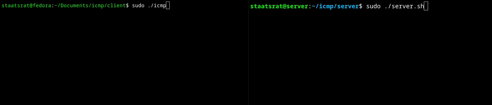

# icmp-communication



#### The tool is still work in progress

A C-based tool for covert data transmission over ICMP packet sizes without using standard payload.

## Client

To use it, enter the correct IP address of the device you want to talk to in the code.

#### 1. Compile

Compile the icmp.c program using gcc: `gcc -o icmp icmp.c`

#### 2. Start

To start the program you will need sudo since otherwise the program can't use sockets.
Use the command `sudo ./icmp`

#### 3. Send

As soon as the program starts you will get a `Message: ` output. Here you have to enter the message you want to send. (I entered a size of 200 bytes so the message can't be longer or you edit it in the code.)

### 4.Execute

If you want to execute a message as a command, write `<command/message>+x` the "x" instructs the server program to execute the message in a shell. Note that anyone can send ICMP packets and execute commands if this function is enabled in the `server.sh` file.

## Server

Then on the receiving device:

#### 1. Start script

Start the server.sh script using `chmod +x server.sh` and `sudo ./server.sh`.
You need sudo so the program can start tcpdump.

#### 2. Wait

The program will wait 5 seconds before it ends. It then echos the sent messages and/or executes the message/command.
An output can look like this:

```text
staatsrat@server:~/icmp/server$ sudo ./serverv.sh
Hi
ls+x

server.sh  serverv.sh
```

### Read it manually

#### 1. Start tcpdump

This is so you can see the incoming packets.

#### 2. Write them into a file

Since it is very hard to read all of them at runtime, write the tcpdump output into a file.
Use the command:
`sudo tcpdump > tcpdump.txt`

#### 3. Analyze

After you get the file, search for the echo packets (these are identifiable via the echo header).
Use the command:
`cat tcpdump.txt | grep echo`
to see all ICMP packets.

#### 4. Read

At the very end of each packet line, the length is the interesting part. You have to compare this length with the ASCII table.

Here it is for all capital letters:
`A = 65, B = 66, C = 67, D = 68, E = 69, F = 70, G = 71, H = 72, I = 73, J = 74, K = 75, L = 76, M = 77, N = 78, O = 79, P = 80, Q = 81, R = 82, S = 83, T = 84, U = 85, V = 86, W = 87, X = 88, Y = 89, Z = 90`

Lowercase letters:
`a = 97, b = 98, c = 99, d = 100, e = 101, f = 102, g = 103, h = 104, i = 105, j = 106, k = 107, l = 108, m = 109, n = 110, o = 111, p = 112, q = 113, r = 114, s = 115, t = 116, u = 117, v = 118, w = 119, x = 120, y = 121, z = 122`

So if you see in the tcpdump for example:

```
22:54:59.180272 IP pc.fritz.box > Server.fritz.box: ICMP echo request, id 0, seq 0, length 72
22:54:59.180272 IP pc.fritz.box > Server.fritz.box: ICMP echo request, id 0, seq 0, length 111
22:54:59.180272 IP pc.fritz.box > Server.fritz.box: ICMP echo request, id 0, seq 0, length 116
22:54:59.180272 IP pc.fritz.box > Server.fritz.box: ICMP echo request, id 0, seq 0, length 100
22:54:59.180272 IP pc.fritz.box > Server.fritz.box: ICMP echo request, id 0, seq 0, length 111
22:54:59.180273 IP pc.fritz.box > Server.fritz.box: ICMP echo request, id 0, seq 0, length 103

```

We see the lengths: 72 = H, 111 = o, 116 = t, 100 = d, 111 = o, 103 = g.

This is how you can decode these messages.

## HELP
If you are running Raspberry Pi os you will have to install `sudo apt update && sudo apt install gawk` for the server.sh pogramm.

## Things that don't work
no encryption. Also there is no way to know what the output of your command was. It should be more of a shell.

I will write that the user gets a response from the server.

Later I will make a YouTube video on this too.
